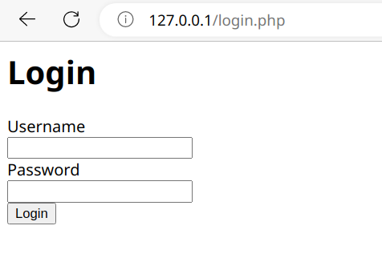
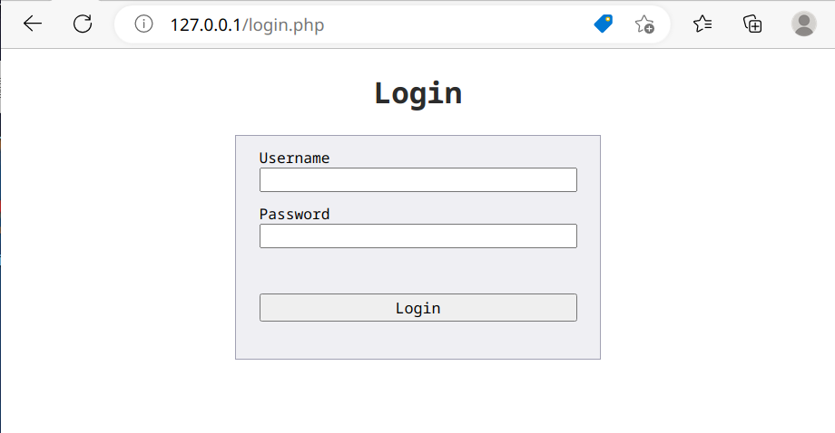

# PHPを用いたマルチページアプリケーションのログインサイト作成
## チュートリアル概要
- 本チュートリアルで学ぶこと
    - PHPの概要、及び基本機能、ログイン機能・セッション管理機能実装
    - HTMLの概要、及び基本タグ一覧、フォームの作成
    - CSSの概要、セレクタ、プロパティ一覧、フォームの装飾
- 難易度
    - ★☆☆☆☆
- 想定必要スキル
    - Nginxの操作

## PHP
Hypertext Preprocessorの略。サーバサイドで動作するスクリプト言語の一つ。

## mysql拡張のインストール
現状ではPHPファイルから、MariaDBへ接続するための拡張機能がインストールされていないため、はじめにインストールを行う。

MariaDBの接続ではMysqliもしくはPDOを用いた方式

詳細は　[Mysqli/PDOの違い](https://www.php.net/manual/ja/mysqli.overview.php)を参照。

MariaDB/MySQLを使うならMysqli、ほかのDBも使うならPDOくらいの認識。今回はMysqliを使用。

```
//mysql拡張のインストール
# sudo apt install php8.1-mysql

//mysql拡張の有効化
# sudo vi /etc/php/8.1/fpm/php.ini
 # 下記のコメントを外す
 extension=php_mysqli.dll

# sudo systemctl restart php8.1-fpm
# sudo systemctl restart nginx

```

## ワーキングディレクトリの作成
事前にワーキングディレクトリを作成。ローカルリポジトリも作成

```
//ワーキングディレクトリの作成
$ mkdir –p ~/work/web101 && cd ~/work/web101
//ファイル作成
$ touch login.php
//ローカルリポジトリの作成
$ git init
//除外ファイルリストの作成
$ touch .gitignore
```

## ログイン画面の作成（login.php）

ログイン画面の仕様は下記の通り。

### HTMLによる画面の実装

**HTMLの基本**

HTML(Hyper-Text Markup Language)は、Webページを作成するための言語。タグを用いた階層構造を持ち、テキスト、画像、段落、情報間のリンクやユーザ入力などを表現する。現在の最新バージョンはHTML5。

各タグは要素と呼ばれ、階層構造で要素感のつながりが表現される。HTMLタグの基本は下記の通り。

```
# タグ基本構成
<div>aaa</div>

# 属性付きタグ
<div id=testid class=testclass>aaa</div>

# 空要素
<br>
<br />
```

| タグ名  | 概要  |
|---|---|
|\<header\>|サイトのtitleなどを記載|
|\<body\>|サイトの本文部分を記載|
|\<div\>|要素をグループ化するときに記載|
|\<form\>|ユーザ入力フォームの作成に使用|
|\<label\>|要素のラベル付に使用|
|\<input\>|ボタン、テキストボックスなどユーザ入力部を記載|
|\<p\>|段落を記載|
|\<br\>|改行を追加|
|\<a\>|リンクを追加|
|\<h1\>〜\<h5\>|見出しを追加|
|\<table\>|表を追加|
|\|画像を追加|
|\<style\>|CSSを記載|
|\<script\>|Javascriptを記載|

**ログイン入力画面をHTMLにて作成**

```
<header>
    <title>Login</title>
</header>
<body>
    <h1 id="loginLabel">Login</h1>
    <div id="loginForm">
        <form action="/login.php" id="form1">
            <label class="loginFormLabel">Username</label><br>
            <input type="text" id="username" name="username" class="loginFormInput"><br>
            <label class="loginFormLabel">Password</label><br>
            <input type="password" id="password" name="password" class="loginFormInput"><br>
            <input type="submit" value="Login">
        </form>
    </div>
</body>

```

### 参考：CSSによるスタイルの変更
CSS（Cascading Style Sheets）はWebページのスタイルを設定するための言語。一般的な様式は下記の通り、\<style>タグに記載するか、インラインでstyle属性に記載する、またはcssファイルとして読み込むなどの手法がある。

記載方式は、セレクタと呼ばれるHTMLの要素を指定する記述子を用いて、要素を指定し、プロパティ及び値でスタイルの設定

```
[セレクタ] {
    [プロパティ1]: [値1];
}

# 例
p {
    font-color: white;
}
```

CSSではどの要素を装飾するかを特定するために、セレクタによる記法を用いる。

参考：[CSSセレクタチートシート](https://webliker.info/css-selector-cheat-sheet/)

| 概要 | 例 |CSSセレクタ|
|---|---|---|
|タグ要素|\<p\>|p|
|子・孫要素|\<div>\<p>\</p>\</div>>|div p|
|id属性|\<div id="idName">\</div>|#idName|
|class属性|\<div class="className">\</div>|.className|
|属性指定|\<div type="submit">\</div>|div[type="submit"]|

またスタイルのプロパティについては下記の通り。

| プロパティ名  | 概要  |
|---|---|
|font-color|フォントの色|
|font-family|フォントの種類|
|background-color|背景色|
|border-color|枠線の色|
|border-style|枠線の種類|
|border-color|背景色|
|text-align|テキストの配置|
|margin|要素の上下左右の余白|
|padding|要素内の上下左右の余白|
|position|要素の位置指定方式|
|height|要素の高さ|
|width|要素の幅|

**ログイン入力画面の装飾**

```
<style>
    body {
        font-family: monospace;
    }
    #loginLabel {
        color: #2c2c2c;
        text-align: center;
        margin: 20px 0px 20px 0px;
    }
    #loginForm {
        background-color: #efeff3;
        padding: 10px;
        margin-left: auto;
        margin-right: auto;
        width: 300px;
        border-style: solid;
        border-color: #a1a1b3;
        border-width: 1px;
    }
    .loginFormLabel {
        position: relative;
        left: 10px;
    }
    .loginFormInput {
        position: relative;
        left: 10px;
        width: 280;
        margin-bottom: 10px;
    }
    input[type="submit"] {
        font-family: monospace;
        margin: 30px 10px 10px 10px;
        width: 280; 
    }
</style>
```

装飾前



装飾後



### MariaDBへの接続部分の作成

全体は、[login.php](login.php)を参照。

はじめにDBに接続するための情報を列挙。

```
    $host = 'localhost';
    $user = 'phptest';
    $dbPassword = 'phptest';
    $db = 'phptest';
```

GETパラメータが入っている場合に、DB接続を開始。


```
    if(isset($_GET['username']) && isset($_GET['password'])){
        $userName = $_GET['username'];
        $userPassword = $_GET['password'];

        $mysqli = new mysqli($host, $user, $dbPassword, $db);
        if ($mysqli->connect_error) {
            exit();
        } 
```

SQL文を構成し、DBに問い合わせを実施


```
        $mysqli->set_charset('utf8');

        $sql = "SELECT * from user WHERE username='".$userName."' and password='".$userPassword."'";

        if($result = $mysqli->query($sql)) {
            
            ~(snip)~

        }

        $mysqli->close();
    }

?>
```

実行結果の内容を確認

```
            if(mysqli_num_rows($result) >= 1) {
                $row = $result->fetch_assoc();
                $userId =  $row['id'];
```

Userが正しい場合は、セッションIDを発行し、DBにセッションIDを書き込んだ上で、Cookie、及びリダイレクトのためのLocationをセット

```
                session_start();
                $sessionId = session_id();

                $sql = $sql = "UPDATE user SET sessionid='".$sessionId."' WHERE id=".$userId;
                if($result = $mysqli->query($sql)) {
                    header("Location: main.php");
                    header("Set-Cookie: sessionid=".$sessionId);
                } 

            } else {
                $error = $userName.' is invalid.<br>';
            }

```

## ページの確認
**PHPファイルをhtmlフォルダに格納**

```
$ sudo cp . /var/www/html -a
```

**ブラウザファイルで読み込み**

```
http://localhost/login.php
```

**デバッグ方法**

- phpのデバッグ方法
    - PHPエラーの確認
    
    ```
    $ tail -f /var/log/nginx/error.log
    ```

    - 変数の確認（スクリプト内のPrint文）

    ```
    var_char();
    ```

- HTML/CSSのデバッグ方法
    - ブラウザのDeveloper tools(WebブラウザからF12で起動)「Element」タブ

- HTTPプロトコルの確認
    - Wireshark
    - Webプロキシツール（Burpsuite/OwaspZAP/MITMproxy/Fiddlerなど）
    - ブラウザのDeveloper tools 「Network」タブ

- Cookieの確認
    - ブラウザのDeveloper tools 「Network」タブ

- Javascriptの確認
    - ブラウザのDeveloper tools 「Source」タブ

# セキュリティ
## SQLインジェクション

## クロスサイトスクリプティング

## セッションハイジャック

## 不正ファイルアクセス

## ディレクトリリスティング

## 認証認可不備